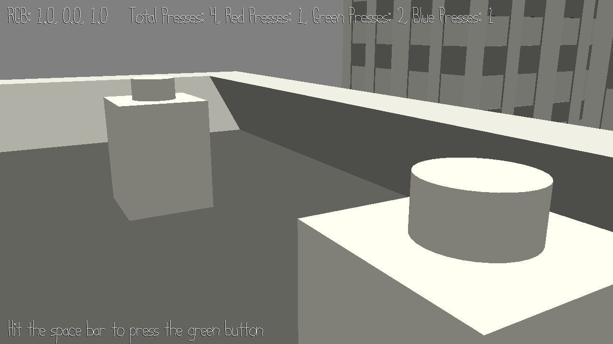

# Color Puzzle
(More like Colorless Puzzle right now)

Author: Tyler Thompson

Design: In this game, the player must press buttons corresponding to certain colors in a certain order in for the sake of returning color to a grey world. The original plan was to have the only feedback on this come in the form of colors appearing as buttons were pressed, but I found editing shaders during runtime to be a bigger technical challenge than I had been anticipating, so for now text on the screen displays the player's progress instead of color in the world (sorry!).

Screen Shot:

How To Play:

Controls: Move with WASD and look with the mouse. When close enough to a button, hit the space bar to press the button.

Strategy: The buttons behave differently depending on how many times that button has been pressed as well as on how many times a button has been pressed total. It is possible to solve the puzzle in 7 presses, though I'm sure there are many solutions. My solution was red, green, blue, green, green, red, red.

Sources: All assets used in this project were made from editing the Blender scenes provided with the base code. Any code help is commented inline. The major callout for code help goes to Dominic Calkosz, who posted his Windows Makefile in the class Discord. That Makefile was a life saver.

This game was built with [NEST](NEST.md).

